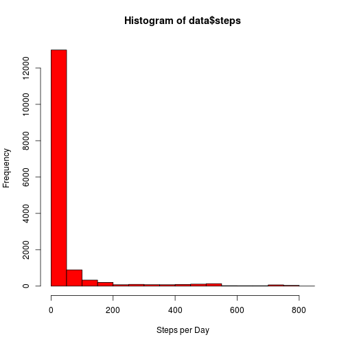
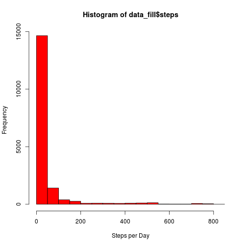

## Loading and preprocessing the data

To begin, we load in the activity data as a data frame.


```r
data = read.csv("activity.csv")
```

The data is already in a nice form, so no need for preprocessing.


## What is mean total number of steps taken per day?

This is easy to do with R - we give, the mean, median, and the requested histogram with a mere 3 lines of code.


```r
mean(data$steps,na.rm=TRUE)
```

```
## [1] 37.3826
```

```r
median(data$steps,na.rm=TRUE)
```

```
## [1] 0
```

```r
hist(data$steps, col="red", xlab="Steps per Day")
```

 


## What is the average daily activity pattern?

As for the daily activity patern, we see that most people sleep overnight, but then the morning seems to be the most active time.


```r
data$interval_average = tapply(data$steps,data$interval,mean,na.rm=TRUE)
plot(data$interval,data$interval_average,type="l",xlab="5 Minute Interval",ylab="Average Number of Steps")
```

 

```r
max(data$interval_average)
```

```
## [1] 206.1698
```

```r
max_int <- which.max(data$interval_average)
data[max_int,]
```

```
##     steps       date interval interval_average
## 104    NA 2012-10-01      835         206.1698
```


## Imputing missing values

First lets see how many missing values there are from each column, and compare that to the total number of rows.


```r
nrow(data)
```

```
## [1] 17568
```

```r
sum(is.na(data$steps))
```

```
## [1] 2304
```

```r
sum(is.na(data$date))
```

```
## [1] 0
```

```r
sum(is.na(data$interval))
```

```
## [1] 0
```

Then we fill in the NA values with the average for that particular time interval.  We make sure that we are filling in the NA values


```r
data_fill = data
data_fill$steps[is.na(data$steps)] = data$interval_average[is.na(data$steps)]
sum(is.na(data_fill$steps))
```

```
## [1] 0
```

```r
head(data,20)
```

```
##    steps       date interval interval_average
## 1     NA 2012-10-01        0        1.7169811
## 2     NA 2012-10-01        5        0.3396226
## 3     NA 2012-10-01       10        0.1320755
## 4     NA 2012-10-01       15        0.1509434
## 5     NA 2012-10-01       20        0.0754717
## 6     NA 2012-10-01       25        2.0943396
## 7     NA 2012-10-01       30        0.5283019
## 8     NA 2012-10-01       35        0.8679245
## 9     NA 2012-10-01       40        0.0000000
## 10    NA 2012-10-01       45        1.4716981
## 11    NA 2012-10-01       50        0.3018868
## 12    NA 2012-10-01       55        0.1320755
## 13    NA 2012-10-01      100        0.3207547
## 14    NA 2012-10-01      105        0.6792453
## 15    NA 2012-10-01      110        0.1509434
## 16    NA 2012-10-01      115        0.3396226
## 17    NA 2012-10-01      120        0.0000000
## 18    NA 2012-10-01      125        1.1132075
## 19    NA 2012-10-01      130        1.8301887
## 20    NA 2012-10-01      135        0.1698113
```

```r
head(data_fill,20)
```

```
##        steps       date interval interval_average
## 1  1.7169811 2012-10-01        0        1.7169811
## 2  0.3396226 2012-10-01        5        0.3396226
## 3  0.1320755 2012-10-01       10        0.1320755
## 4  0.1509434 2012-10-01       15        0.1509434
## 5  0.0754717 2012-10-01       20        0.0754717
## 6  2.0943396 2012-10-01       25        2.0943396
## 7  0.5283019 2012-10-01       30        0.5283019
## 8  0.8679245 2012-10-01       35        0.8679245
## 9  0.0000000 2012-10-01       40        0.0000000
## 10 1.4716981 2012-10-01       45        1.4716981
## 11 0.3018868 2012-10-01       50        0.3018868
## 12 0.1320755 2012-10-01       55        0.1320755
## 13 0.3207547 2012-10-01      100        0.3207547
## 14 0.6792453 2012-10-01      105        0.6792453
## 15 0.1509434 2012-10-01      110        0.1509434
## 16 0.3396226 2012-10-01      115        0.3396226
## 17 0.0000000 2012-10-01      120        0.0000000
## 18 1.1132075 2012-10-01      125        1.1132075
## 19 1.8301887 2012-10-01      130        1.8301887
## 20 0.1698113 2012-10-01      135        0.1698113
```

As we can see, this method changes neither the mean nor the median of the steps taken.


```r
hist(data_fill$steps, col="red", xlab="Steps per Day")
```

 

```r
mean(data_fill$steps,na.rm=TRUE)
```

```
## [1] 37.3826
```

```r
median(data_fill$steps,na.rm=TRUE)
```

```
## [1] 0
```


## Are there differences in activity patterns between weekdays and weekends?

To compute this we first define the following useful function.


```r
is.weekday <- function(string){
  day <- weekdays(as.Date(string))
  return(day == "Monday" | day == "Tuesday" | day == "Wednesday" | day == "Thursday" | day == "Friday")
}
```

With this tool in our pocket, we proceed to create a new column in the data frame which lets us know whether a day is a weekday or a weekend.  We then use this information to create another column which has the average steps per interval over days of the same type, and plot these average steps vs. the intervals for both weekdays and weekends.


```r
data$day_type <- as.factor(ifelse(is.weekday(data$date),"weekday","weekend"))

data$int.day <- paste(data$interval, data$day_type, sep=".")
x <- tapply(data$steps, data$int.day, mean,na.rm="TRUE")
data$day_average <- x[data$int.day]


par(mfrow=c(2,1))
with(data[data$day_type == "weekday",],plot(interval,day_average,type="l", xlab="5 Min. Interval (Weekday)", ylab="Average Number of Steps"))
title("Average Steps over 5 Minute Intervals, Weekday vs. Weeked")
with(data[data$day_type == "weekend",],plot(interval,day_average,type="l", xlab="5 Min. Interval (Weekend)", ylab="Average Number of Steps"))
```

 

FIN
